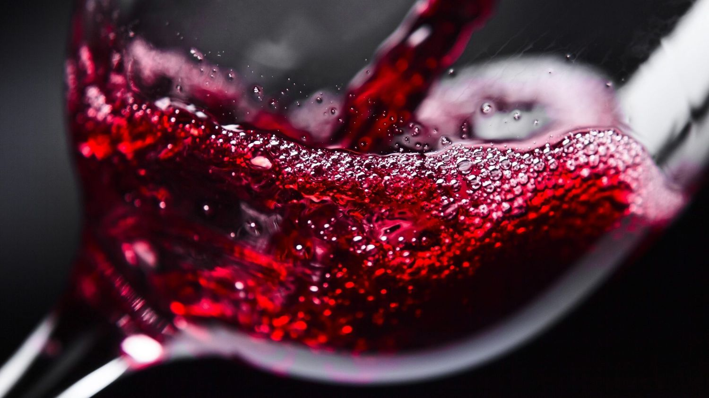

  

    Fixed acidity
    Volatile acidity
    Citric acid
    Residual sugar
    Chlorides
    Free sulfur dioxide
    Total sulfur dioxide
    Density
    pH
    Sulfates
    Alcohol

Objectives:

The objectives of this project are as follows:

    To experiment with different classification methods to see which yields the highest accuracy
    To determine which features are the most indicative of a good quality wine

Steps included in this project:

    Importing Lib
    Loading Data
    Understanding Data
    Missing Values
    Exploring Variables(Data Anylasis)
    Feature Selection
    Proportion of Good vs Bad Wines
    Preparing Data for Modelling
    Applying different models
    Choosing right model
